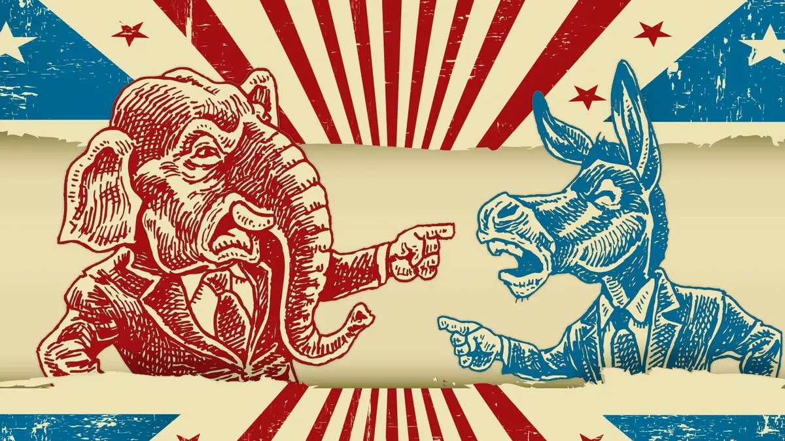


  {{ page.title | default: site.title }}



  {{ page.description | default: site.description }}




[Introduction text]  

<!-- Missing image source -->


[Biases in our data. Do we want to use a [dedicated page](/biases) for them?]



[Let's tell a story here!] 

<!-- Sample plot -->


[More story] 
 
<!-- Sample image inside text -->

[Yet more story] 

# References

[Sources of data (Quotebank, wikidata, info on news outlets, images etc.)]

# About us

<!-- Imo not needed but I give you the choice :) -->
[Some info about the team members? On a separate page?]
